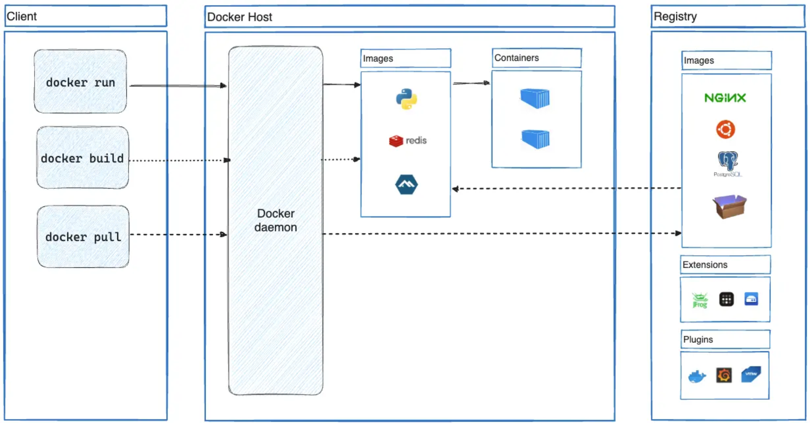
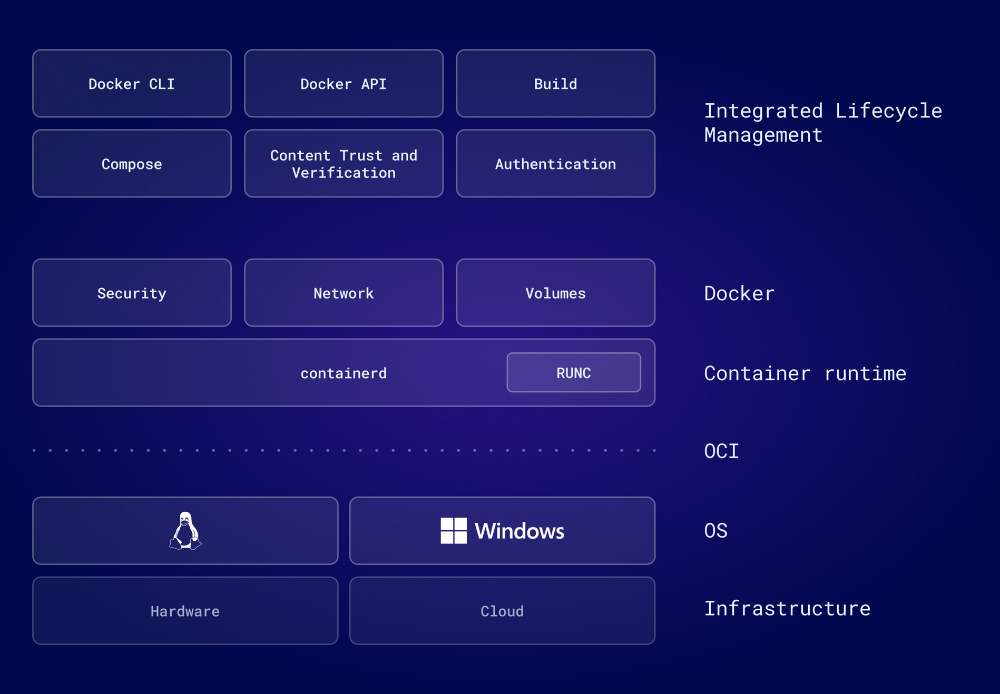
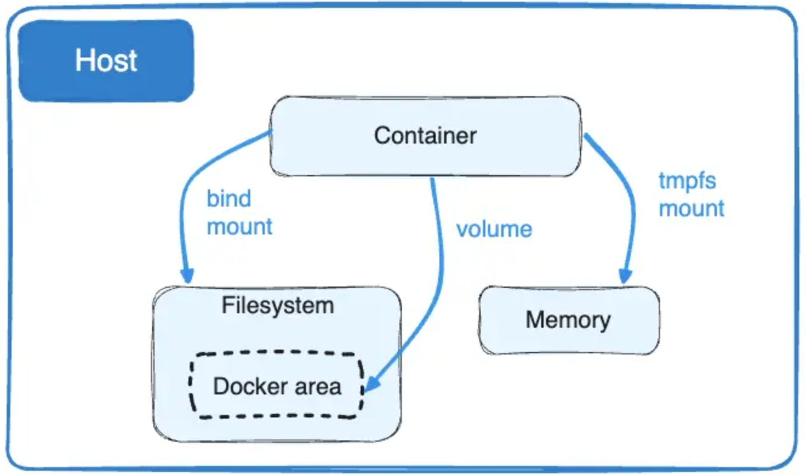

### 一、整体架构

Docker 是开源的容器化平台，通过将应用程序及其依赖项打包成一个轻量级、可移植的容器，然后在任何支持 Docker 的环境中运行这些容器，实现更简单、更高效的部署和管理。下图是 Docker 官方文档给出的 Docker 整体架构图。

Docker 的整体架构是一个 C/S 架构，Docker 客户端与 Docker 守护进程通信，由后者负责构建、运行和分发容器的繁重工作。Docker 守护进程提供 REST API 支持，使用 UNIX 套接字或网络接口来提供服务。Docker Registry 提供了 Docker 镜像使用、存储和注册的支持，其中 Docker Hub 是 Docker 官方提供的公共 Registry，Docker 默认在 Docker Hub 上查找镜像。

在这里对 Docker 进行管理的核心概念容器与镜像进行简单的介绍。一个镜像是一个只读的模板，包含创建一个 Docker 容器的说明。通常，一个镜像基于另一个镜像，并进行一些额外的自定义。容器是镜像的可运行实例，可以使用 Docker API 或 CLI 创建、启动、停止或删除容器。可以将容器连接到一个或多个网络，为其附加存储，甚至根据当前状态创建一个新的镜像。容器是具有附加隔离和资源管理功能的进程，可以在有限制的条件下访问主机系统资源。

此外，从上面的描述中不难发现，Docker 不仅仅指的是一个命令行程序或某些服务进程，他还包含了众多 Docker 公司为容器和镜像搭建的生态环境以及对容器构建、运行、测试、验证和分享的整体解决方案。事实上，Docker 的容器运行时在 2017 年因为种种原因开源（即在下一小节中会进一步介绍的 containerd），并在之后通过 CNCF 基金会进行管理。Docker 公司也将工作中心放在了构建全面工具链、提供整体服务和生态维护上。
#### 1.1 containerd 容器运行时

containerd 是一个为运行容器构建的符合 OCI 开放标准的运行时。containerd 构建在操作系统内和功能之上，并通过抽象层改进了容器管理，从而为开发人员隐藏容器底层机制的复杂性。通过使用 RUNC 等较低级别的容器运行时，确保容器化环境中的标准和互操作性，并有效地处理容器生命周期中的核心操作，包括创建、启动和停止容器。

在目前的架构中，containerd 通过直接与操作系统交互来促进容器上的操作，而 Docker 引擎位于 containerd 之上，旨在提供额外的功能和增强的开发人员体验。

具体来说，当运行 docker run 命令会进行以下流程：

- Docker CLI 通过 REST API 调用将运行命令和命令参数发送至 Docker 守护进程；
- Docker 守护进程解析并验证请求，检查容器镜像等内容是否在本地可用，以及是否需要从 Docker Registry 中拉取镜像；
- 一旦镜像准备好，Docker 守护进程就将控制权转移给 containerd，并由 containerd 从镜像创建容器；
- containerd 设置容器环境，包括设置容器文件系统、网络接口和其他隔离功能等任务；
- containerd 使用 shim 进程将容器的运行委托给 RUNC，这将创建并启动容器；
- 最后，一旦容器开始运行，containerd 将监控容器状态并相应地管理其生命周期。
#### 1.2 OCI 与 CRI 标准

OCI 是一个开放的行业标准，旨在定义容器格式和运行时规范，以确保容器在不同的平台上可移植、可互操作性。通过推动容器技术的标准化，从而提高容器生态环境的可持续性。

除此之外，Kubernetes 作为一个开源且成熟的容器编排平台，基于容器技术的基础之上，提供了一个强大的工作集来解决容器化应用程序的部署、管理和扩展问题，定义了 CRI 标准，用于与容器运行时通信，以管理容器的生命周期。CRI 标准的核心目标是将 Kubernetes 的容器管理功能与容器运行时解耦，使得 Kubernetes 能够以统一的方式与不同的容器运行时进行交互。

然而，由于Docker 本身不直接支持 CRI 标准，为了能够在 Kubernetes 中使用 Docker，Kubernetes 在发展阶段通过一些适配器的工作来兼容 Docker。目前 Kubernetes 已经移除了对 Docker 的支持，并直接使用 containerd 来操作容器。作为 CNCF 的子项目，containerd 很好地提供了 CRI 标准的支持。
### 二、命名空间隔离与系统资源限制

namespace 和 cgroups 是 Linux 操作系统中用于资源隔离和管理的两个关键技术。

namespace 允许在同一台物理机上创建隔离的环境，每个环境都有自己的视图，就好像它们在独立的系统上运行一样。这种隔离使得多个进程可以在同一台主机上运行，彼此间互不干扰。常见的 namespace 包括：PID namespace，允许在系统中创建进程隔离，每个 PID namespace 中的进程只能看到相同 namespace 中的其他进程；Mount namespace，为不同进程提供独立的文件系统视图，使得在不同的 Mount namespace 中可以挂载不同的文件系统；Network namespace，允许不同的进程拥有独立的网络栈；User namespace，为进程提供独立的用户和组标识符空间，允许在不同的 namespace 中有相同的用户和组的名称，但实际上对应不同的用户和组。

cgroups 允许系统管理员限制和控制一组进程的资源使用，包括 CPU、内存、磁盘 I/O 等。通过将进程防止在 cgroups 中，管理员可以为这些进程分配资源配额，确保它们不会消耗系统的全部资源。cgroups 是多个资源控制器的集合，包括 cpu、memory、blkio、net_cls 和 devices 等。

> chroot 是一个 Linux 命令，用于改变当前进程及其子进程的根目录。这个命令不如 namespace 和 cgroups 强大，但可以创造一种类似于容器的环境，在执行 chroot 后，进程将无法访问新根目录之外的文件系统内容。
### 三、Docker 中的数据管理
#### 3.1 联合文件系统

Docker 通过联合文件系统技术来实现容器的轻量化和高效的文件系统管理。联合文件系统的基本原理是通过将多个文件系统挂载在同一个目录下，使它们看起来像是一个单一的文件系统，但实际上数据存储在各自的文件系统中。

Docker 镜像是由多个层组成的，每个层都是文件系统的一个快照，包含了构建镜像时所添加或修改的文件。每个层都只包含自身的变化，因此可以高效地共享和重用已有的层。这使得 Docker 镜像可以非常轻量，因为它们通常只存储应用程序的变化部分，而不是整个文件系统。当一个容器启动时，Docker 会创建一个读写层，用于容器运行时的文件写入操作。这个读写层是基于镜像的只读层构建的，但是采用写时复制机制，从而确保了原始镜像的不变性。

联合文件系统将 Docker 容器中的多个层联合挂载在一起，形成一个单一的文件系统试图。当容器的应用程序访问文件时，联合文件系统根据文件路径逐层向下查找，同时只在最上层的读写层中覆盖、重写或添加文件。由于镜像只有只读层组成，因此确保了应用程序环境的一致性和可重复性。

通过联合文件系统机制，Docker 实现高效的文件系统管理和轻量级的容器化。联合文件系统使得 Docker 容器可以快速启动，占用少量的存储空间，并且可以方便地与其他容器共享文件系统中的内容，提供了容器的性能和可移植性。

Docker 提供了多种联合文件系统的支持，在早期版本的 Docker 中，AUFS 是 Docker 中默认使用的联合文件系统，但后来由于一些兼容性和稳定性的问题，Docker 目前默认使用 OverlayFS 实现容器的轻量化和高效的文件系统管理。
#### 3.2 卷与文件系统挂载

默认情况下，容器中写入的文件系统更新都存储在上一小节中提到的可写层中，这意味着：当容器不再存在时，数据不会持久存在，并且另一个进程很难从容器中获取数据；容器的可写层与运行容器的主机紧密耦合，很难将数据移动到其他地方；这种联合文件系统额外的抽象相较于直接写入主机文件系统相比，显然会降低性能，即使联合文件系统通常在操作系统内核中实现。

Docker 提供了 bind mount 和 volume 两个方式可以让容器在主机上存储文件，以便即使在容器停止后文件依然存在。此外，Docker 还提供了 tmpfs 用于将文件存储在内存中。

一个简单且直观的差异在于数据存储位置：volume 存储在由 Docker 管理的主机文件系统的一部分中，非 Docker 进程不应该修改文件系统的这一部分，这也是 Docker 推崇的保存数据的最佳方式；挂载的目录可以主机系统中的任何位置，非 Docker 进程可能会随时修改它。tmpfs 中的数据仅存储在主机系统的内存中，并且不会写入主机系统的文件系统中，容器可以在容器的生命周期内使用它来存储非持久状态或敏感信息。
### 四、Docker 使用实践
#### 4.1 开发环境统一神器 Dev Container

Dev Container 是 vscode 提供的一个插件，与 vscode 集成良好。Dev Container 提供了一种开发配置工具，支持在容器中构建、开发、运行和调试应用程序，而无需在本地安装和配置所有必需的软件和依赖项。

Dev Container 通过项目目录下的 .devcontainer 文件夹来定义这些环境。在实践中，可以使用 Dockerfile 定义开发容器的基础镜像和构建步骤，并通过一个名为 devcontainer.json 的文件，配置容器的其他属性，例如挂载目录、端口映射和环境变量等。

通过使用 Dev Container，不仅可以在各种主机上快速启动一致的开发环境，并且可以为每个项目的配置环境进行隔离，避免所有的系统配置都直接安装在主机上。此外，编写 Dev Container 配置文件的过程也是记录开发环境配置的过程，具有复用性。
#### 4.2 单节点多容器部署 Docker Compose

Docker Compose 是 Docker 官方提供的一个工具，用于定义和运行多个 Docker 容器的应用程序。它通过一个简单的 YAML 文件来配置应用程序的服务、网络和卷等，并可以一键运行相关容器和运行环境。在项目开发过程中，可以通过 Docker Compose 来定义服务的运行流程，便于使用和部署，以及梳理各容器在整体服务中扮演的角色。
#### 4.3 与 Github Actions 的 CI 集成

Github Actions 是 Github 提供的自动化集成测试和部署流程工具，通过在项目目录下编写相关工作流配置文件，可以定义各种灵活的 CI/CD 流程，并在每次提交代码时自动执行。在工作流中，可以通过 Docker 来定义工作流的测试环境，Docker 可以轻松地将测试运行在各种具体环境中。
#### 4.4 一些好用的 Docker 服务列表

> Github 上有众多基于 Docker 一键部署的服务，但说实话，很多对我来说都没什么实际的使用价值，这部分记录了一些日常会使用且非常喜欢的 Docker 服务，持续 update ~

- [memos](https://github.com/usememos/memos): 本地部署的日记、周报和随想记录网站
### 相关参考

- https://docs.docker.com/manuals/
- https://docs.docker.com/get-started/overview/
- https://www.docker.com/blog/containerd-vs-docker/