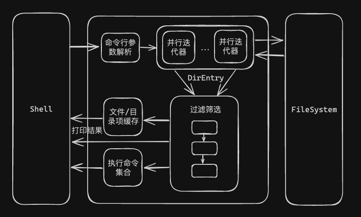

## 一、基本介绍

fd 是一个 Rust 实现的用于在文件系统中寻找文件和目录项的命令行程序，提供了一系列简单、快速、用户友好的功能。fd 旨在替代 find 命令。find 命令是在 Unix 和类 Unix 操作系统中使用的一个强大的命令行工具，用于在文件系统中搜索文件和目录。find 命令的基本语法如下：

```Shell
find [起始目录] [匹配条件] [动作]
```

其中起始目录指定搜索的起始目录，匹配条件用于指定搜索文件的条件，可以是文件名、文件类型、文件大小等，动作用于指定在找到匹配项后执行的动作，例如打印文件名、删除文件等。作为替代的 find 的 fd，fd 有如下特征：

* 更直观的语法；
* 基于正则表达式和 glob 的模式匹配；
* 并行的目录遍历，大幅度的速度优化；
* 使用颜色来突出显示不同类型的文件；
* 并行命令执行的支持；
* 智能大小写处理；
* 默认情况下忽略隐藏的目录和文件；
* 默认情况下，忽略 .gitignore 中的模式匹配。

> 1）基于 glob 的模式匹配是一种用于匹配文件路径或名称的简单模式匹配方法，通常在命令行中使用。这种模式使用通配符来表示匹配一类文件或目录的模式，相较于正则表达式更加简单，语法和功能有一定限制。在很多情况下是一种简便而有效来指定文件路径的模式。
> 
> 2）根据作者提供的测试数据，fd 相较于 find 命令可以取得一个数量级上的性能提升。fd 速度上的性能提升主要归功于并行的目录遍历以及相关正则表达式处理库。

fd 可以实现多种方式的搜索，例如根据包含指定字符串的搜索、正则表达式搜索、指定根目录的搜索、搜索一个特定的文件扩展名、搜索一个特定的文件名、搜索隐藏和忽略的文件、匹配完整路径的搜索、执行命令的搜索、排除特定文件或目录的搜索，也可以将多种搜索条件在一次搜索中进行表达。
作为 Github 上的明星项目，fd 已有近 30k 的 star 数，同时也是基于 Rust 实现的诸多命令行工具中最具有代表性的项目之一。本文将会大致介绍 fd 的整体框架和实现逻辑，值得一提的是命令行程序会有诸多不可避免的实现上的繁琐性，对于一些细节代码，本文不会做过多展开。
## 二、整体框架



fd 使用了 jemalloc 内存分配器替换了默认的系统内存分配器。Rust 提供了一种插件式的内存分配器接口，允许开发者使用不同的内存分配器。jemalloc 是一种高效的内存分配器，尤其适用于多线程的应用程序，同时提供了内存分析能力。
## 三、过滤筛选

fd 作为一个强大、易用的检索工具，提供了多种过滤筛选的方式。
### 3.1 基于类型的筛选

```Rust
#[derive(Default)]
pub struct FileTypes {
    pub files: bool,
    pub directories: bool,
    pub symlinks: bool,
    pub sockets: bool,
    pub pipes: bool,
    pub executables_only: bool,
    pub empty_only: bool,
}

impl FileTypes {
    pub fn should_ignore(&self, entry: &dir_entry::DirEntry) -> bool { ... }
}
```

fd 通过 FileTypes 记录了需要在命令行展示文件和目录的类型。通过 should_ignore 函数将在文件系统遍历中得到的文件和目录根据 FileTypes 设置进行基于类型的筛选。
### 3.2 基于权限的筛选

```Rust
#[derive(Clone, Copy, Debug, PartialEq, Eq)]
pub struct OwnerFilter {
    uid: Check<u32>,
    gid: Check<u32>,
}

#[derive(Clone, Copy, Debug, PartialEq, Eq)]
enum Check<T> {
    Equal(T),
    NotEq(T),
    Ignore,
}

impl OwnerFilter {
    pub fn matches(&self, md: &fs::Metadata) -> bool { ... }
}
```

fd 通过 OwnerFilter 记录需要在命令行展示文件和目录的权限范围，matches 函数根据具体的元数据来实现基于权限的筛选。
### 3.3 基于大小的筛选

```Rust
#[derive(Clone, Copy, Debug, PartialEq, Eq)]
pub enum SizeFilter {
    Max(u64),
    Min(u64),
    Equals(u64),
}

impl SizeFilter {
    pub fn is_within(&self, size: u64) -> bool { ... }
}
```

fd 通过 SizeFilter 记录基于大小的筛选条件，并提供了 is_within 函数。
### 3.4 基于时间的筛选

```Rust
#[derive(Debug, PartialEq, Eq)]
pub enum TimeFilter {
    Before(SystemTime),
    After(SystemTime),
}

impl TimeFilter {
    pub fn applies_to(&self, t: &SystemTime) -> bool { ... }
}
```

fd 通过 TimeFilter 记录基于时间的筛选条件，并提供了 applies_to 函数。
## 四、文件系统遍历

文件系统遍历是 fd 所需要考虑的第一个核心功能，fd 需要获取指定目录下的所有目录和文件，才能做进一步的处理、筛选和展示。事实上，fd 通过 ignore 第三方 crate 来实现这一功能，ignore crate 提供了一个快速递归目录迭代器。
### 4.1 数据结构抽象

```Rust
enum DirEntryInner {
    Normal(ignore::DirEntry),
    BrokenSymlink(PathBuf),
}

pub struct DirEntry {
    inner: DirEntryInner,
    metadata: OnceCell<Option<Metadata>>,
    style: OnceCell<Option<Style>>,
}
```

fd 通过 DirEntry 保存在文件系统遍历过程中获取的文件和目录项，并提供了一系列获取路径和元数据以及命令行显示风格的方法。
### 4.2 并行遍历模式
#### 4.2.1 数据接收缓存

```Rust
#[derive(PartialEq)]
enum ReceiverMode {
    Buffering,
    Streaming,
}

#[allow(clippy::large_enum_variant)]
pub enum WorkerResult {
    Entry(DirEntry),
    Error(ignore::Error),
}

struct ReceiverBuffer<W> {
    config: Arc<Config>,
    quit_flag: Arc<AtomicBool>,
    interrupt_flag: Arc<AtomicBool>,
    rx: Receiver<WorkerResult>,
    stdout: W,
    mode: ReceiverMode,
    deadline: Instant,
    buffer: Vec<DirEntry>,
    num_results: usize,
}

impl<W: Write> ReceiverBuffer<W> {
    fn process(&mut self) -> ExitCode { ... }
    fn recv(&self) -> Result<WorkerResult, RecvTimeoutError> { ... }
    fn poll(&mut self) -> Result<(), ExitCode> { ... }
    fn print(&mut self, entry: &DirEntry) -> Result<(), ExitCode> { ... }
    fn stream(&mut self) -> Result<(), ExitCode> { ... }
    fn stop(&mut self) -> Result<(), ExitCode> { ... }
}
```

fd 通过 channel 实现单消费者多生产者模型并构建数据流水线。当开始路径遍历过程时，fd 会 spawn 一个新的线程创建 ReceiverBuffer 数据结构，并调用其 process 函数进行循环处理。

process 函数采用了状态机模型，其中的每一次循环都会调用 poll 函数。poll 函数代表着一次数据处理或是状态转换，函数处理逻辑如下：

* 调用 recv 函数从 channel 中接收一个数据。ReceiverBuffer 有两种接收模式，Buffering 和 Streaming 模式。在 Buffering 模式下，recv 函数会等待 channel 中的数据直到达到 ReceiverBuffer 的 deadline。而 Streaming 模式会一直等待 channel 返回数据。在默认情况下 ReceiverBuffer 初始化为 Buffering 模式。
* 根据 recv 函数的返回情况实现不同的行为。
	* 当 recv 函数成功返回一个文件或目录项时，如果当前的接收模式仍为 Buffering 模式时，将数据插入 buffer，并在 buffer 的数据量大于设置的阈值时调用 stream 函数。stream 函数会将当前的接收模式修改为 Streaming 模式，并使用 print 函数打印 buffer 中的所有文件或目录项。如果当前的接收模式为 Streaming 模式时，调用 print 函数直接打印该文件或目录项。
	* 当 recv 函数返回超时错误时，说明在 Buffering 模式下，recv 函数在达到 deadline 时仍未接收到新数据，调用 stream 函数，打印现有 buffer 中的数据，并将接收模式修改为 Streaming 模式。
	* 当 recv 函数返回 channel 关闭消息时，则调用 stop 方法。如果当前 ReceiverBuffer 仍为 Buffering 接收模式，则排序 buffer 中的数据并打印。

> **为什么需要有 Buffering 和 Streaming 两种接收模式？**
> 
> 在文件系统遍历初期，可能有大量结果需要输出，通过缓存的方式批量输出结果降低输出压力。在达到一定的时间或数据量后，如果仍需要有数据输出，则可以切换至 FIFO 模式输出结果。
#### 4.2.2 并行数据发送

fd 在遍历文件系统时，会通过 ignore crate 构建一个并行的目录迭代器。并行的目录迭代器会根据设置 spawn 多个线程，每个线程会通过相同的方式处理目录迭代器产生的遍历结果。当目录迭代器返回一个遍历结果时，首先判断是否返回了错误，如果在遍历过程中发生了错误，则直接将错误通过 channel 发送至 ReceiverBuffer，ReceiverBuffer 会直接打印错误信息。然后会先根据文件或目录项的名字进行筛选，因为根据名字进行筛选不需要获取元数据，再根据第二章中提到的各种筛选方式进行筛选。当满足所有条件后，将数据发送至 ReceiverBuffer。
## 五、命令执行模型

fd 不仅仅可以显示搜索的结果，也支持对搜索结果执行一系列的外部命令。fd 为搜索结果提供了两种执行外部命令的方式：

* -x/--exec 选项为每个搜索结果并行地运行一个外部命令；
* -X/--exec-batch 选项启动外部命令一次，并将所有搜索结果作为参数。

fd 还支持使用占位符语法将命令作为一种模版而不是单个字符串时用，具体来收，fd 提供了对如下占位符的支持：

* {}：一个占位符标记，将被搜索结果的路径所替换；
* {.}：与 {} 类似，但会去除搜索结果的文件扩展名；
* {/}：将被搜索结果的文件名所替换；
* {//}：将被搜索结果的父目录路径所替换；
* {/.}：去除搜索结果文件扩展名的文件名。

当没有使用占位符时，实际上 fd 会自动在末尾加上 {}。
### 5.1 命令相关数据结构抽象

```Rust
#[derive(Clone, Debug, PartialEq, Eq)]
pub enum Token {
    Placeholder,
    Basename,
    Parent,
    NoExt,
    BasenameNoExt,
    Text(String),
}

#[derive(Clone, Debug, PartialEq)]
enum ArgumentTemplate {
    Tokens(Vec<Token>),
    Text(String),
}

#[derive(Debug, Clone, PartialEq)]
struct CommandTemplate {
    args: Vec<ArgumentTemplate>,
}
```

Token 代表着占位符的类型，ArgumentTemplate 是命令的参数单元，多个 ArgumentTemplate 组成了一个完整的命令。
### 5.2 CommandSet 数据结构

```Rust
#[derive(Debug, Clone, Copy, PartialEq, Eq)]
pub enum ExecutionMode {
    OneByOne,
    Batch,
}

#[derive(Debug, Clone, PartialEq)]
pub struct CommandSet {
    mode: ExecutionMode,
    commands: Vec<CommandTemplate>,
}

impl CommandSet {
    pub fn new<I, T, S>(input: I) -> Result<CommandSet>
    where
        I: IntoIterator<Item = T>,
        T: IntoIterator<Item = S>,
        S: AsRef<str>,
    { ... }

    pub fn new_batch<I, T, S>(input: I) -> Result<CommandSet>
    where
        I: IntoIterator<Item = T>,
        T: IntoIterator<Item = S>,
        S: AsRef<str>,
    { ... }

    pub fn execute(
        &self,
        input: &Path,
        path_separator: Option<&str>,
        out_perm: Arc<Mutex<()>>,
        buffer_output: bool
    ) -> ExitCode { ... },

    pub fn execute_batch<I>(&self, paths: I, limit: usize, path_separator: Option<&str>) -> ExitCode
    where
        I: Iterator<Item = PathBuf>,
    { ... }
}
```

CommandSet 代表 fd 需要执行的命令集合。CommandSet 有两种执行模式，OneByOne 和 Batch 模式。
在 OneByOne 模式下，调用 execute 函数会将 fd 在文件系统遍历过程中得到的单个结果依据 CommandTemplate 生成完整的命令表示，并打印输出命令执行结果。值的一提的是，OneByOne 模式并不意味着 fd 一次只会处理一个文件系统得到的遍历结果，fd 会根据设置并发多个线程对多个遍历结果执行各自的命令集合。在多个线程前提下，fd 会使用输出缓存，等待单个遍历结果全部执行完毕命令集合后一起输出最后的执行结果。如果只使用一个线程接收文件系统遍历的结果并执行命令时，fd 不使用输出缓存，而是启动一个新的进程并等待它完成。这样做的好处是允许查看中间命令输出并与之交互。

```Rust
#[derive(Debug)]
struct CommandBuilder {
    pre_args: Vec<OsString>,
    path_arg: ArgumentTemplate,
    post_args: Vec<OsString>,
    cmd: Command,
    count: usize,
    limit: usize,
    exit_code: ExitCode,
}

impl CommandBuilder {
    fn push(&mut self, path: &Path, separator: Option<&str>) -> io::Result<()> { ... }
    fn finish(&mut self) -> io::Result<()> { ... }
}
```

在 Batch 模式下，调用 execute_batch 函数使用 fd 遍历文件系统得到的所有结果构造 CommandBuilder，用于在命令执行过程中添加多个结果参数。

> 本文基于 v8.7.0 版本的 fd 实现。
> 
> Github 地址：https://github.com/sharkdp/fd