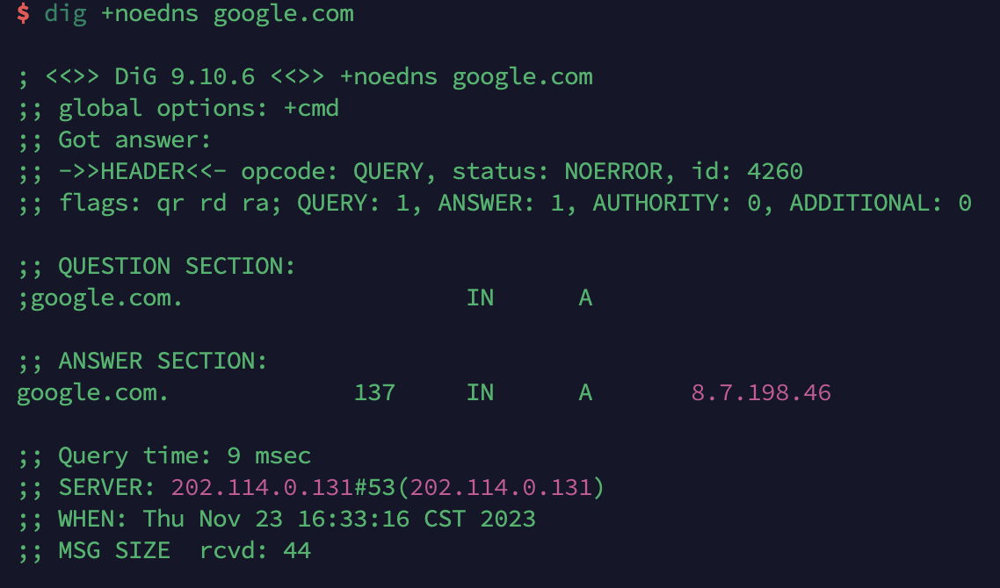
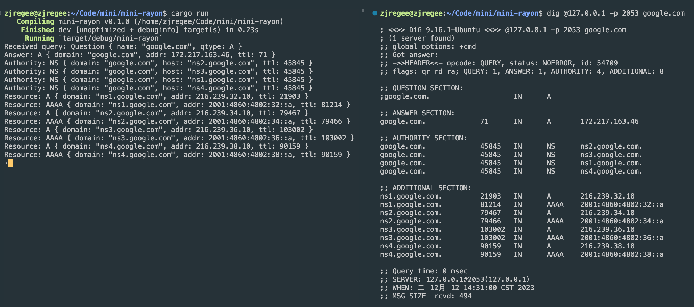

> 本文是 mini 系列的第一篇文章，mini 系列是一些知名框架或技术的最小化实现。本系列文章仅作为学习积累的目的，代码或架构在很大程度上参考了现有的一些源码或博客。本文实现了一个可作为 DNS 完整解析流程一部分的最小化 DNS 客户端，并详细介绍了 DNS 协议的原理细节。
> 代码实现地址：https://github.com/zjregee/mini/mini-dns
## 一、DNS 解析流程
### 1.1 什么是 DNS 解析

DNS 解析是将域名转换为相应的 IP 地址的过程。在互联网上，计算机和其他网络设备使用 IP 地址来定位和通信。然而，用户更容易记住和使用易于理解的域名，而不是复杂的 IP 地址。因此，DNS 解析充当了域名和 IP 地址之间的桥梁。DNS 解析的基本任务是将用户输入的域名映射到对应的 IP 地址。这个过程涉及到一系列的查询和响应步骤，包括本地域名服务器、根域名服务器、顶级域名服务器和权威域名服务器等。
### 1.2 分层域名体系

互联网的域名体系采用层次树状结构，通过众多分布式的域名服务器系统进行解析操作，不仅提高了域名解析的效率，也保障了作为互联网基础设施的域名解析的稳定性。分层的域名体系不仅体现在由 . 隔开的层次结构的域名名称，更依赖于层次划分各司其职的多种 DNS 域名服务器：

* 根域名服务器：DNS 层次结构中的最高级别，负责存储顶级域名服务器的 IP 地址。它不直接负责解析域名，而是提供指向顶级域名服务器的地址信息。
* 顶级域名服务器：管理顶级域的服务器，它存储了与特定的顶级域相关的权威域名服务器的 IP 地址，负责管理在该服务器注册的所有二级域名。
* 权威域名服务器：权威域名服务器是负责存储特定域名解析信息的服务器。当一个权威域名服务器不能给出查询结果的时候，就会告诉请求方下一步寻找哪一个权威域名服务器。
* 本地域名服务器：本地域名服务器本身并不属于层次树状结构的一部分，但在整个域名系统中扮演着行使请求方职责的重要任务。当一个用户计算机发出 DNS 查询请求时，会将查询请求报文交给本地域名服务器处理。
### 1.3 DNS 解析完整流程

具体来说一个完整的 DNS 域名解析流程包括以下几个步骤：

* 用户输入需要 DNS 解析服务的域名；
* 检查浏览器缓存中是否有域名对应的解析过的 IP 地址，如果缓存中有，则结束解析过程。浏览器缓存域名是有限制的，不仅浏览器缓存大小有限制，而且缓存的时间也有限制，通常情况下为几分钟到几小时不等，域名被缓存的时间限制可以通过 TTL 属性来设置；
* 如果浏览器缓存中没有数据，浏览器会查找操作系统缓存中是否有这个域名对应的 DNS 解析结果。在 Linux 中还可以通过 /etc/hosts 文件来将任何域名解析到任何能够访问的 IP 地址；
* 当前两个过程无法解析时，就要用到网络配置中的本地域名服务器的地址了。操作系统会将这个域名发送给本地域名服务器，后续的 DNS 域名解析迭代和递归也是由本地域名服务器负责；
* 本地域名服务器向根域名服务器发起查询请求，询问它关于顶级域的权威域名服务器的 IP 地址；
* 本地域名服务器向得到的权威顶级域名服务器发送查询请求，讯问它关于二级域名的权威域名服务器的 IP 地址；
* 本地域名服务器向得到的权威域名服务器发送查询请求；
* 将查询结果返回给用户的计算机，用户可以通过获取的 IP 地址建立连接。

> 容易混淆的一点是本地域名服务器虽然称之为本地，但通常情况下并不是直接运行在用户的计算机中，而是由用户所连接的网络提供的。用户计算机通常通过动态主机配置协议（DHCP）或手动配置等方式从网络中获取本地域名服务器的 IP 地址。本地域名服务器通过迭代查询或递归查询等过程负责处理用户计算机发起的 DNS 解析请求，使得用户计算机无需感知其他的根域名服务器、顶级域名服务器和权威域名服务器等服务的存在。
### 1.4 mini-dns 设计及充当的角色

在上一小节介绍 DNS 解析流程的时候已经提到了电脑中的 DNS 缓存分为两部分，它们分别是由操作系统管理的系统缓存和由浏览器管理的 DNS 缓存。这两个缓存通常都是存储在内存里，用于提高域名解析的速度，而没有保存在磁盘上的文件系统中。

事实上，操作系统提供的系统 DNS 缓存以及 DNS 解析能力根据操作系统的不同而存在一定差异。以 Ubuntu 为例，Ubuntu使用 systemd-resolved 负责处理域名解析和 DNS 服务。systemd-resolved 是 systemd 体系结构中的一部分，它提供了一个本地的 DNS 解析器和缓存。systemd-resolved 在本地维护一个 DNS 缓存，用于存储之前解析的域名信息，这有助于避免重复向 DNS 服务器发出相同的查询请求，提高了解析的效率。systemd-resolved 还提供了 DNSSEC 支持，用于验证 DNS 响应的真实性和完整性，以提高安全性，以及 mDNS 支持，这是一种用于本地网络上的无配置服务发现的多播 DNS 协议。浏览器所需要的 DNS 解析能力也是建立在使用 systemd-resolved 提供的服务的基础上。

mini-dns 作为一个最小化 DNS 客户端实现，并不是为了替代 systemd-resolved，也不是为了替代本地域名服务器，而是与 systemd-resolved 协同工作。在 Ubuntu 系统中，加入 mini-dns 后的 DNS 解析流程如下：

* 操作系统或浏览器需要 DNS 服务时，首先将查询请求发送给 systemd-resolved；
* systemd-resolved 查看本地缓存，如果没有缓存命中，则先去查询 hosts 文件。如果仍没有相关信息，则将查询请求转发至 mini-dns；
* mini-dns 完成后续的查询请求，并将结果返回给 system-resolved。

从上述流程中可以看出，mini-rayon 旨在更灵活地控制本地域名解析，可以配置一些特殊域名或区域的处理，实现本地定制的 DNS 解析。其次，本地 DNS 客户端可以通过持久化方式缓存一些更长期的域名对应关系，但客观来说，协同工作对于性能提升还是有限的，因为，在实际的网络环境中，即使需要通过网络连接来发送 DNS 查询请求也不会跑多远就遇到诸多缓存，很难看到有明显的性能提升。此外，在上述流程的第三步，mini-dns 实际上可以实现本地域名服务器的功能，替代本地域名服务器的工作，完成迭代或递归的 DNS 解析流程。但这样做的意义有限，因此 mini-dns 只是将 DNS 解析请求直接转发给本地域名服务器。
## 二、DNS 协议介绍

### 2.1 DNS 记录类型

DNS 记录是存储在域名系统数据库中的数据项，用于将域名与其他信息关联起来。这些记录包含了关于域名的各种信息，例如与域名相关联的 IP 地址、邮件服务器信息、文本信息等。DNS 记录有多种类型，每种类型有不同的用途，这些不同类型的记录协同工作，搭建了一个完善的层次结构。下面是一些常见的 DNS 记录类型：

* A 记录：映射域名到一个 IPv4 地址；
* AAAA 记录：映射域名到一个 IPv6 地址；
* CNAME 记录：创建域名的别名，将一个域名指向另一个域名；
* MX 记录：指定接收域的电子邮件的邮件服务器；
* PTR 记录：用于将 IP 地址映射回域名，通常用于反向 DNS 查找；
* NS 记录：指定域名的权威域名服务器，负责存储该域的 DNS 记录；
* TXT 记录：存储与域名相关的文本信息，通常用于验证域名所有权或提供其他信息；
* SOA 记录：包含有关域的权威信息，如域的主要域名服务器、域的管理员和域的参数；
* SRV 记录：用于指定特定服务的主机和端口。
### 2.2 DNS 报文格式

DNS 报文通常采用 UDP 进行传输，报文长度限制为 512 字节。这两条规则也有例外，DNS 报文可以通过 TCP 使用，并且通过称为 eDNS 的机制扩展数据包大小，但是本文不会过多涉及这些。DNS 报文使用相同的查询和响应格式，这与大多数互联网协议不同，大多数互联网协议使用不同的请求和响应结构。DNS 报文的数据包格式如下：

* Header：12 字节，查询和响应的相关信息；
* Question Section：大小可变，表明查询域名和感兴趣的记录类型，在实际使用中，往往只有一个 Question；
* Answer Section：大小可变，所请求的相关记录；
* Authority Section：大小可变，NS 记录列表，用于递归地解析查询；
* Additional Section：大小可变，可能有用的一些记录，例如记录 NS 记录相关的 A 记录。

每个 Section 中的记录数由 Header 中的字段提供，Header 的结构如下：

| RFC Name | Descriptive Name | Length | Description |
| --- | --- | --- | --- |
| ID | Packet Identifier | 16 bits | 为查询报文分配一个随机标识，响应报文必须使用相同的标识进行应答。这是由于 UDP 的无状态特性，区分响应所必须的。 |
| QR | Query Response | 1 bit | 0 代表查询报文，1 代表响应报文。 |
| OPCODE | Operation Code | 4 bits | 通常为 0，具体的细节要参考 RFC 1035。 |
| AA | Authoritative Answer | 1 bit | 如果响应服务器拥有所查询的域，设置为 1。 |
| TC | Truncated Message | 1 bit | 如果报文长度超过 512 字节，则设置为 1。通常用于提示使用 TCP 重新发出查询，TCP 不限制长度。 |
| RD | Recursion Desired | 1 bit | 由请求的发送方设置，如果服务器在没有现成的答案时需要尝试递归地解析查询。 |
| RA | Recursion Available | 1 bit | 由服务器设置，指示是否允许递归查询。 |
| Z | Reserved | 3 bits | 最初作为保留字段，现在用于 DNSSEC 查询。 |
| RCODE | Response Code | 4 bits | 由服务器设置，指示响应是否成功，在失败时提供有关失败原因的详细信息。 |
| QDCOUNT | Question Count | 16 bits | Question Section 中的记录数。 |
| ANCOUNT | Answer Count | 16 bits | Answer Section 中的记录数。 |
| NSCOUNT | Authority Count | 16 bits | Authority Section 中的记录数。 |
| ARCOUNT | Additional Count | 16 bits | Additional Section 中的记录数。 |

单个 Question Section 的记录包含如下字段：

* Name：被编码成一个标签序列的域名，会在之后进一步说明；
* Type：2 字节的整型，代表记录的类型；
* Class：2 字节的整型，在实践中通常为 1。

单个 Answer Section 的记录包含如下字段：

* Name：被编码成一个标签序列的域名；
* Type：2字节的整型，代表记录的类型；
* Class：2 字节的整型，在实践中通常为 1；
* TTL：4 字节的整形，记录可以缓存的时间；
* Len：2 字节的整型，记录类型特定数据的长度；
* Data：记录的数据，例如当记录为 A 类型时，Data 中的数据是 4 字节整型编码的 IP 地址。
### 2.3 DNS 操作示例

在这一小节我们会通过 dig 命令行工具来直观的感受 DNS 协议的实际使用。dig 是一个用于查询 DNS 信息的网络工具，可以用于诊断网络问题，验证 DNS 配置以及获取与域名相关的信息。



可以看到 dig 明确描述了响应报文的 header、question section 和 answer section。header 中的 opcode 使用 OPCODE QUERY，对应于 0。status 也就是 RCODE，被设置为 NOERROR，对应于 0。id 为 4260，在重复查询时会随机更改。启用了 QR、RD、RA 标志位，它们的数值为 1。最后 header 还告诉了我们在 query section 和 answer section 分别有一个记录。answer section 显示了查询的结果，其中 IN 表示 class ，137 是 TTL，A 告诉我们在查询 A 记录，以及 google.com 的 IP 为 8.7.198.46。最后我们还知道了报文的总大小为 44 字节。
### 2.4 一些更复杂的现实

由于 DNS 报文的大小限制，单个数据包最大为 512 字节，并且大部分的数据空间用于存储域名，数个域名之间往往会存在大量的重复字符串，因此在报文中会通过数据压缩的方式来节省数据空间的使用。

```Shell
# dig @a.root-servers.net com

- snip -

;; AUTHORITY SECTION:
com.                172800  IN  NS      e.gtld-servers.net.
com.                172800  IN  NS      b.gtld-servers.net.
com.                172800  IN  NS      j.gtld-servers.net.
com.                172800  IN  NS      m.gtld-servers.net.
com.                172800  IN  NS      i.gtld-servers.net.
com.                172800  IN  NS      f.gtld-servers.net.
com.                172800  IN  NS      a.gtld-servers.net.
com.                172800  IN  NS      g.gtld-servers.net.
com.                172800  IN  NS      h.gtld-servers.net.
com.                172800  IN  NS      l.gtld-servers.net.
com.                172800  IN  NS      k.gtld-servers.net.
com.                172800  IN  NS      c.gtld-servers.net.
com.                172800  IN  NS      d.gtld-servers.net.

;; ADDITIONAL SECTION:
e.gtld-servers.net. 172800  IN  A       192.12.94.30
b.gtld-servers.net. 172800  IN  A       192.33.14.30
b.gtld-servers.net. 172800  IN  AAAA    2001:503:231d::2:30
j.gtld-servers.net. 172800  IN  A       192.48.79.30
m.gtld-servers.net. 172800  IN  A       192.55.83.30
i.gtld-servers.net. 172800  IN  A       192.43.172.30
f.gtld-servers.net. 172800  IN  A       192.35.51.30
a.gtld-servers.net. 172800  IN  A       192.5.6.30
a.gtld-servers.net. 172800  IN  AAAA    2001:503:a83e::2:30
g.gtld-servers.net. 172800  IN  A       192.42.93.30
h.gtld-servers.net. 172800  IN  A       192.54.112.30
l.gtld-servers.net. 172800  IN  A       192.41.162.30
k.gtld-servers.net. 172800  IN  A       192.52.178.30
c.gtld-servers.net. 172800  IN  A       192.26.92.30
d.gtld-servers.net. 172800  IN  A       192.31.80.30

- snip -
```

考虑上述的查询示例，我们查询互联网根服务器之一以获取处理 .com 的顶级域名服务器 IP 地址。gtld-servers.net 在查询结果中不断的重复出现，如果数据包中只需要包含这个字符串一次，并通过某种方式使得其他地方都指向这个字符串，显然可以大大压缩数据包大小。事实上，DNS 报文也是通过跳转的方式来实现数据压缩，它会告诉数据包的解析器如何跳转位置，完成名称的读取。

之前我们提到过，记录中的 Name 字段会将每个域名编码为一系列标签，这一设计就是为了这里的数据压缩做下铺垫。在 DNS 数据报文中，每个标签前面都有一个指示其长度的字节，并且每个域名都以零长度的标签，即一个空字节结尾。例如 google 是 6 个字节，那么它的名称标签前面就是 0x06，com 是 3 个字节，前面就会是 0x03。如果这个标签前面的指示其长度的字节设置了两个最高的有效位，这代表着标签名称并不直接跟在这个字节的后面，而是需要将指示长度的字节和紧跟着的一个字节拼在一起，并除去两个最高有效位，获得标签名称的跳转地址。一旦获取标签名称后，就可以从之前中断的位置继续读取解析 DNS 数据包。
## 三、报文序列与反序列化实现

在介绍完 DNS 协议后，我们就可以着手于具体的代码实现，得益于 DNS 多种记录格式统一的设计模式，在解析的过程中不会引入过多的复杂性。
### 3.1 QueryType

```Rust
#[derive(Copy, Clone, Debug, PartialEq, Eq, Hash)]
pub enum QueryType {
	UNKNOWN(u16),
	A,
	NS,
	CNAME,
	MX,
	AAAA,
}
```

DNS 记录类型非常多，其中一部分在现实中几乎不会被使用，在这里我们首先定义我们需要着重实现的常用记录类型。
### 3.2 BytePacketBuffer

```Rust
pub struct BytePacketBuffer {
	pub buf: [u8; 512],
	pub pos: usize,
}

impl BytePacketBuffer {
	pub fn new() -> BytePacketBuffer { }
	
	pub fn pos(&self) -> usize {
		self.pos
	}
	
	pub fn step(&mut self, steps: usize) -> Result<()> {
		self.pos += steps;
		Ok(())
	}
	
	pub fn seek(&mut self, pos: usize) -> Result<()> {
		self.pos = pos;
		Ok(())
	}
	
	pub fn read(&mut self) -> Result<u8> { }
	
	pub fn get(&mut self, pos: usize) -> Result<u8> { }
	
	pub fn get_range(&mut self, start: usize, len: usize) -> Result<&[u8]> { }
	
	pub fn read_u16(&mut self) -> Result<u16> { }
	
	pub fn read_u32(&mut self) -> Result<u32> { }
	
	pub fn read_qname(&mut self, outstr: &mut String) -> Result<()> { }
	
	pub fn write(&mut self, val: u8) -> Result<()> { }
	
	pub fn write_u8(&mut self, val: u8) -> Result<()> { }
	
	pub fn write_u16(&mut self, val: u16) -> Result<()> { }
	
	pub fn write_u32(&mut self, val: u32) -> Result<()> { }
	
	pub fn write_qname(&mut self, qname: &str) -> Result<()> { }
	
	pub fn set(&mut self, pos: usize, val: u8) -> Result<()> { }
	
	pub fn set_u16(&mut self, pos: usize, val: u16) -> Result<()> { }
}
```

为了更简便的操作 DNS 数据包，我们定义了一个 BytePacketBuffer 数据结构，它记录了数据和读写位置并提供了一系列操作数据包的方法。
### 3.3 Header

```Rust
#[derive(Clone, Debug)]
pub struct Header {
	pub id: u16,
	pub recursion_desired: bool,
	pub truncated_message: bool,
	pub authoritative_answer: bool,
	pub opcode: u8,
	pub response: bool,
	pub rescode: ResultCode,
	pub checking_disabled: bool,
	pub authed_data: bool,
	pub z: bool,
	pub recursion_available: bool,
	pub questions: u16,
	pub answers: u16,
	pub authoritative_entries: u16,
	pub resource_entries: u16,
}

impl Header {
	pub fn read(&mut self, buffer: &mut BytePacketBuffer) -> Result<()> { }
	
	pub fn write(&self, buffer: &mut BytePacketBuffer) -> Result<()> { }
}
```

我们用 Header 内存数据结构表示 DNS 数据报文的 Header 部分，并提供 read、write 方法处理 Header 的读取、解析与写入。
### 3.4 Question

```Rust
#[derive(Clone, Debug, PartialEq, Eq)]
pub struct Question {
	pub name: String,
	pub qtype: QueryType,
}

impl Question {
	pub fn read(&mut self, buffer: &mut BytePacketBuffer) -> Result<()> { }
	
	pub fn write(&self, buffer: &mut BytePacketBuffer) -> Result<()> { }
}
```

Question 内存数据结构表示 DNS 数据报文的 Question Section，同样提供 read、write 方法处理读取、解析与写入。
### 3.5 Record

```Rust
#[derive(Clone, Debug, PartialEq, Eq, PartialOrd, Ord, Hash)]
pub enum Record {
	UNKNOWN {
		domain: String,
		qtype: u16,
		data_len: u16,
		ttl: u32,
	}, // 0
	A {
		domain: String,
		addr: Ipv4Addr,
		ttl: u32,
	}, // 1
	NS {
		domain: String,
		host: String,
		ttl: u32,
	}, // 2
	CNAME {
		domain: String,
		host: String,
		ttl: u32,
	}, // 5
	MX {
		domain: String,
		priority: u16,
		host: String,
		ttl: u32,
	}, // 15
	AAAA {
		domain: String,
		addr: Ipv6Addr,
		ttl: u32,
	}, // 28
}

impl Record {
	pub fn read(buffer: &mut BytePacketBuffer) -> Result<Record> { }
	
	pub fn write(&self, buffer: &mut BytePacketBuffer) -> Result<usize> { }
}
```

Record 内存数据结构对应 DNS 数据报文中的单个记录，并且由于 DNS 数据报文中的其余部分均是由数个 Record 列表顺序排列而成的数据，所以通过 Record 即可表示出 DNS 数据报文的其他区域。Record 内存数据结构使用枚举类型，枚举类型便于表达出 Record 的类型多样性，以及每种类型特定的解析数据，并且易于拓展，可以方便地添加更多的记录类型。
### 3.6 Packet

```Rust
#[derive(Clone, Debug)]
pub struct Packet {
	pub header: Header,
	pub questions: Vec<Question>,
	pub answers: Vec<Record>,
	pub authorities: Vec<Record>,
	pub resources: Vec<Record>,
}

impl Packet {
	pub fn from_buffer(buffer: &mut BytePacketBuffer) -> Result<Packet> { }
	
	pub fn write(&mut self, buffer: &mut BytePacketBuffer) -> Result<()> { }
}
```

最后我们通过 Packe 内存数据结构将 DNS 数据报文的各个部分组织在一起。
## 四、DNS 客户端实现与部署
### 4.1 客户端实现

```Rust
fn lookup(qname: &str, qtype: QueryType) -> Result<Packet> {
	let server = ("8.8.8.8", 53);
	let socket = UdpSocket::bind(("0.0.0.0", 43210))?;
	let mut packet = Packet::new();
	packet.header.id = 6666;
	packet.header.questions = 1;
	packet.header.recursion_desired = true;
	packet.questions.push(Question::new(qname.to_string(), qtype));
	let mut req_buffer = BytePacketBuffer::new();
	packet.write(&mut req_buffer)?;
	socket.send_to(&req_buffer.buf[0..req_buffer.pos], server)?;
	let mut res_buffer = BytePacketBuffer::new();
	socket.recv_from(&mut res_buffer.buf)?;
	Packet::from_buffer(&mut res_buffer)
}
```

在上一节我们完成了 DNS 数据报文的解析，即实现了序列与反序列化后，我们就可以通过网络连接发送我们构造的报文来验证实现。在上面我们实现了一个 lookup 函数，lookup 函数需要输入待查询的域名和查询类型，然后构造出一个数据包，并将这个数据包发送至地址为 8.8.8.8 的服务器，这是一个 Google 的公共本地域名服务器。这个服务器会帮助我们完成 DNS 解析的查询过程，并返回查询结果。我们解析返回的 DNS 数据报文，在这个数据报文中可以获取我们想要的查询结果。

```Rust
fn handle_query(socket: &UdpSocket) -> Result<()> { }

fn main() -> Result<()> {
	let socket = UdpSocket::bind(("0.0.0.0", 2053))?;
	loop {
		match handle_query(&socket) {
			Ok(_) => {}
			Err(e) => eprintln!("An error occurred: {}", e),
		}
	}
}
```

接着我们像常见的网络编程方式一样，在程序的 main 函数中实现一个监听循环，将每一个发送至监听端口的待处理的 DNS 解析需求通过 lookup 获取结果并返回。这样我们就完成了 DNS 客户端的功能。
### 4.2 部署与测试

测试我们所实现的 mini-dns 可以有两种方式，第一种方式我们可以协同配置 mini-dns 与 systemd-resolved，这样计算机中的任何 DNS 解析请求都会通过 mini-dns 来实现。 协同配置方法的如下：

* 运行 mini-dns 在某一端口，监听 DNS 查询请求；
* 修改 systemd-resolved 配置文件 /etc/systemd/resolved.conf，指向 mini-dns 监听的地址和端口。

在这里，为了方便展示，我们直接使用第二种方式，即使用 dig 工具来直接测试 mini-dns。



可以看到，我们在运行 mini-dns 后，通过 dig -p 参数指定了查询的端口。dig 获取了正确的查询结果，mini-dns 在终端中也打印出了一些中间结果，验证了 mini-dns 在 DNS 解析流程中的正确性。
## 参考资料

* https://github.com/EmilHernvall/dnsguide